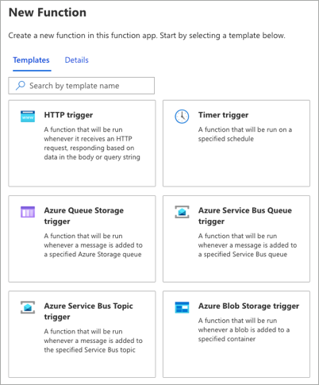
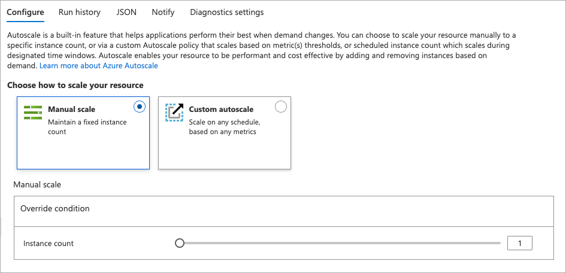
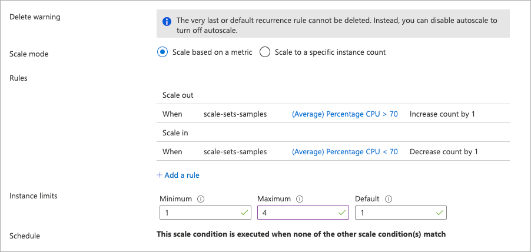

# Automate operational tasks

Operational tasks can include any action or activity you may perform while managing systems, system access, and processes. Some examples include rebooting servers, creating accounts, and shipping logs to a data store. These tasks may occur on a schedule, as a response to an event or monitoring alert, or ad-hoc based on external factors. Like many other activities related to managing computer systems, these activities are often performed manually, which takes time, and are error-prone.

Many of these operational tasks can and should be automated. Using scripting technologies and related solutions, you can shift effort from manually performing operational tasks towards building automation for these tasks. In doing so, you achieve so much, including:

- Reduce time to perform an action.
- Reduce risk in performing the action.
- Automated response to events and alerts.
- Increased human capacity for further innovation.

When working in Azure, you have many options for automating operational tasks. This document details some of the more popular.

## Azure Functions

Azure Functions allows you to run code without managing the underlying infrastructure on where the code is run. Functions provide a cost-effective, scalable, and event-driven platform for building applications and running operational tasks. Functions support running code written in a range of programming languages including C#, Java, JavaScript, Python, and PowerShell.

When creating a Function, a hosting plan is selected. Hosting plans controls how a function app is scaled, resource availability, and availability of advanced features such as virtual network connectivity and startup time. The hosting plan also influences the cost.

Functions hosting plans:

- **Consumption:** Default hosting plan, pay only for Function execution time, configurable timeout period, automatic scale.
- **Premium:** Faster start, VNet connectivity, unlimited execution duration, premium instance sizes, more predictable pricing.
- **Dedicated:** Functions run on dedicated virtual machines and can use custom images.

For full details on consumption plans, see [Azure Functions scale and hosting](/azure/azure-functions/functions-scale).

Functions provide event-driven automation; each function has a trigger associated with it. These triggers are what run the functions. Common triggers include:

- **HTTP / Webhook:** Function is run when an HTTP request is received.
- **Queue:** Function is run when a new message arrives in a message queue.
- **Blob storage:** Function is run when a new blob is created in a storage container.
- **Timer:** Function is run on a schedule.

Below are example triggers seen in the Azure portal when creating a new function



Once an event has occurred that initiates a Function, you may also want to consume data from this event or from another source. Once a Function has been completed, you may want to publish or push data to an Azure service such as a Blob Storage. Input and output are achieved using input and output bindings. For more information about triggers and bindings, see [Azure Functions triggers and binding concepts](/azure/azure-functions/functions-triggers-bindings).

Both PowerShell and Python are common languages for automating everyday operational tasks. Because Azure Functions supports both of these languages, it is an excellent platform for hosting, running, and auditing automated operational tasks. For example, let's assume that you would like to build a solution to facilitate self-service account creation. An Azure PowerShell Function could be used to create the account in Azure Active Directory. An HTTP trigger can be used to initiate the Function, and an input binding configured to pull the account details from the HTTP request body. The only remaining piece would be a solution that consumes the account details and creates the HTTP requests against the Function.

**Learn more**

- [Documentation: Azure Functions PowerShell developer guide](/azure/azure-functions/functions-reference-powershell)
- [Documentation: Azure Functions Python developer guide](/azure/azure-functions/functions-reference-python)

## Azure Automation

PowerShell and Python are popular programming languages for automating operational tasks. Using these languages, performing operations like restarting services, moving logs between data stores, and scaling infrastructure to meet demand can be expressed in code and executed on demand. Alone, these languages do not offer a platform for centralized management, version control, or execution history. The languages also lack a native mechanism for responding to events like monitoring driven alerts. To provide these capabilities, an automation platform is needed.

Azure Automation provides an Azure-hosted platform for hosting and running PowerShell and Python code across Azure, non-Azure cloud, and on-premises environments. PowerShell and Python code is stored in an Azure Automation Runbook, which has the following attributes:

- Execute Runbooks on demand, on a schedule, or through a webhook.
- Execution history and logging.
- Integrated secrets store.
- Source Control integration.

As seen in the following image, Azure Automation provides a portal experience for managing Azure Automation Runbooks. Use the included code sample (ARM template) to deploy an Azure automation account, automation runbook, and explore Azure Automation for yourself.


**Learn more**

- [Documentation: What is Azure Automation](/azure/automation/automation-intro)?

## Scale operations

So far, this document has detailed options for scripting operational tasks; however, many Azure services come with built-in automation, particularly in scale operations. As application demand increases (transactions, memory consumption, and compute availability), you may need to scale the application hosting platform so that requests continue to be served. As demand decreases, scaling back not only appropriately resizes your application but also reduces operational cost.

In cloud computing, scale activities are classified into two buckets:

- **Scale-up:** Adding additional resources to an existing system to meet demand.
- **Scale-out:** Adding additional infrastructure to meet demand.

Many Azure services can be scaled up by changing the pricing tier of that service. Generally, this operation would need to be performed manually or using detection logic and custom automation.

Some Azure services support automatic scale-out, which is the focus of this section.

### Azure Monitor autoscale

Azure Monitor autoscale can be used to autoscale Virtual Machine Scale Sets, Cloud Services, App Service Web Apps, and API Management service. To configure scale-out operations for these services, while in the Azure portal, select the service, and then **scale-out** under the resource settings. Select **Custom** To configure autoscaling rules. Automatic scale operations can also be configured using an Azure Resource Manager Template, the Azure PowerShell module, and the Azure CLI.



When creating the autoscale rules, configure minimum and maximum instance counts. These settings prevent inadvertent costly scale operations. Next, configure autoscale rules, at minimum one to add more instances, and one to remove instances when no longer needed. Azure Monitor autoscale rules give you fine-grain control over when a scale operation is initiated. See the Learn more section below for more information on configuring these rules.



**Learn more**

- [Documentation: Azure Monitor autoscale overview](/azure/azure-monitor/platform/autoscale-overview)

### Azure Kubernetes Service

Azure Kubernetes Service (AKS) offers an Azure managed Kubernetes cluster. When considering scale operations in Kubernetes, there are two components:

- **Pod scaling:** Increase or decrease the number of load balanced pods to meet application demand.
- **Node scaling:** Increase or decrease the number of cluster nodes to meet cluster demand.

Azure Kubernetes Service includes automation to facilitate both of these scale operation types.

#### Horizontal pod autoscaler

Horizontal pod autoscaler (HPA) monitors resource demand and automatically scales pod replicas. When configuring horizontal pod autoscaling, you provide the minimum and maximum pod replicas that a cluster can run and the metrics and thresholds that initiate the scale operation. To use horizontal pod autoscaling, each pod must be configured with resource requests and limits, and a **HorizontalPodAutoscaler** Kubernetes object must be created.

The following Kubernetes manifest demonstrates resource requests on a Kubernetes pod and also the definition of a horizontal pod autoscaler object.

```yaml
apiVersion: apps/v1
kind: Deployment
metadata:
  name: azure-vote-back
spec:
  replicas: 1
  selector:
    matchLabels:
      app: azure-vote-back
  template:
    metadata:
      labels:
        app: azure-vote-back
    spec:
      nodeSelector:
        "beta.kubernetes.io/os": linux
      containers:
      - name: azure-vote-back
        image: redis
        # Resource requests and limits
        resources:
          requests:
            cpu: 100m
            memory: 128Mi
          limits:
            cpu: 250m
            memory: 256Mi
        ports:
        - containerPort: 6379
          name: redis
---
apiVersion: autoscaling/v1
kind: HorizontalPodAutoscaler
metadata:
  name: azure-vote-back-hpa
spec:
  maxReplicas: 10 # define max replica count
  minReplicas: 3  # define min replica count
  scaleTargetRef:
    apiVersion: apps/v1
    kind: Deployment
    name: azure-vote-back
  targetCPUUtilizationPercentage: 50 # target CPU utilization
```

#### Cluster autoscaler

Where horizontal pod autoscaling is a response to demand on a specific application of service running in a Kubernetes cluster, cluster autoscaling responds to demand on the entire Kubernetes cluster itself. If a Kubernetes cluster does not have enough compute resources or nodes to facilitate all requested pods' resource requests, some of these pods will enter a non-scheduled or pending state. In response to this situation, additional nodes can be automatically added to the cluster. Conversely, once compute resources have been freed up, the cluster nodes can automatically be removed to match steady-state demand.

Cluster autoscaler can be configured when creating an AKS cluster. The following example demonstrates this operation with the Azure CLI. This operation can also be completed with an Azure Resource Manager template.

```azurecli
az aks create \
  --resource-group myResourceGroup \
  --name myAKSCluster \
  --node-count 1 \
  --vm-set-type VirtualMachineScaleSets \
  --load-balancer-sku standard \
  --enable-cluster-autoscaler \
  --min-count 1 \
  --max-count 3
```

Cluster autoscaler can also be configured on an existing cluster using the following Azure CLI command.

```azurecli
az aks update \
  --resource-group myResourceGroup \
  --name myAKSCluster \
  --enable-cluster-autoscaler \
  --min-count 1 \
  --max-count 3
```

See the included documentation for information on fine-grain control for cluster autoscale operations.

**Learn more**

- [Documentation: Horizontal pod autoscaling](/azure/aks/tutorial-kubernetes-scale#autoscale-pods)
- [Documentation: AKS cluster autoscaler](/azure/aks/cluster-autoscaler)
