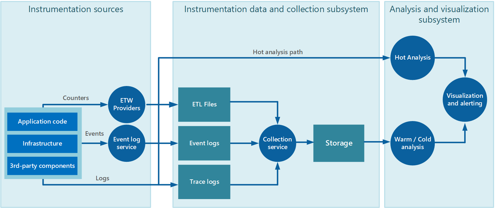
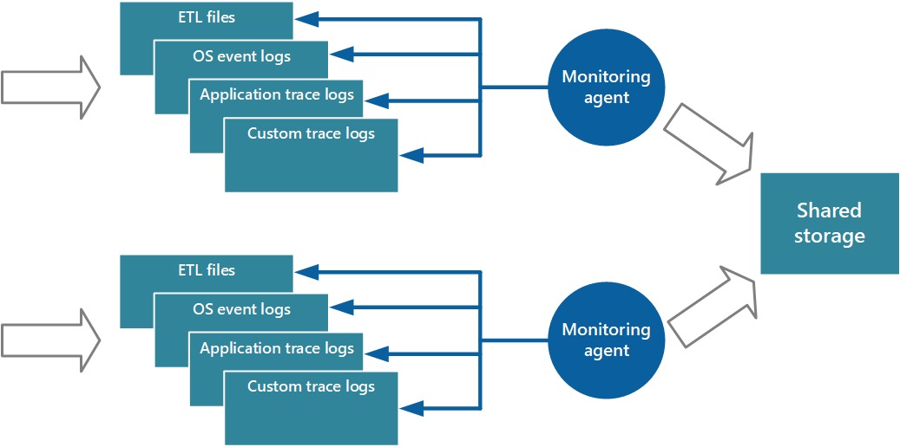
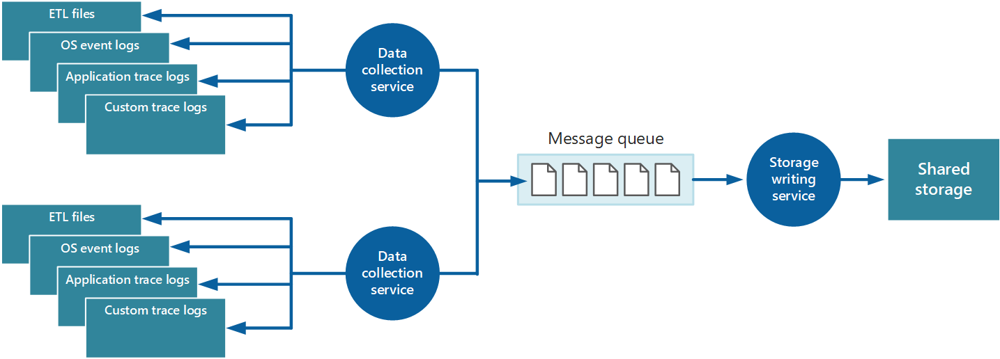

# Collect, aggregate, and store monitoring data for cloud applications

In a distributed system, instrumentation can generate large volumes of data from many components, held in various locations, and in different formats. 

For example, an application code might generate trace log files and application event log data. From the infrastructure perspective, performance counters are captured through other technologies. Also, any third-party components and services that the application uses might provide their own instrumentation information in different formats, by using separate trace files, blob storage, or even a custom data store. 

This article provides best practices for collecting data from various sources, consolidating and cleaning various formats, and storing in reliable storage. 

## Best practices

- Have technologies to collect and aggregate application logs across environments, diagnostics logs from application resources, infrastructure, and other critical dependencies.

- The collection service should run as an out-of-process service and should be simple to deploy.

- All output from the collection service should be a structured and agnostic format.  

- The monitoring and data-collection process must be fail-safe and must not trigger any cascading error conditions.

- In the event of a transient failure in sending information to a data sink, the collection service should be prepared to reorder telemetry data so that the newest information is sent first. (The monitoring agent/data-collection service might elect to drop the older data, or save it locally and transmit it later to catch up, at its own discretion.)

## Architecture
This image shows a typical instrumentation data-collection process.

- Data collection service collects data from various sources is not necessarily a single process and might comprise many constituent parts running on different machines. 
- If you need data to be analyzed quickly, local components that operate outside the collection service might perform the analysis tasks immediately. The results can be sent directly to the visualization and alerting systems. 
- If you don't need immediate analysis, data is held in storage while it awaits processing.

The hot, warm, and cold analysis patterns are summarized in [Analysis patterns](/azure/architecture/framework/devops/monitor-analysis#analysis-patterns).

## Application data

In case of an application, the collecting service can be an **Application Performance Management (APM) tool** that can run autonomously from the application that generates the instrumentation data. After APM is enabled, you'll have clear visibility of important metrics both in real time and historically. Consider an  appropriate level of logging. Verbose logging  can incur significant costs.

An example of an APM is [Application Insights](/azure/azure-monitor/app/data-retention-privacy#what-is-application-insights) that aggregates application level logs and events for subsequent analysis. 

**Application logs** support the end-to-end application lifecycle. Logging is essential in understanding how the application operates in various environments and what events occur and under which conditions.

Collecting application logs and events across all major environments is recommended. Separate the data between environments as much as possible. Have filters to ensure non-critical environments do not convolute production log interpretation. Furthermore, corresponding log entries across the application should capture a correlation ID for their respective transactions.

**Application events should be captured as a structured data type** with machine-readable data points rather than unstructured string types. A structured format, following well-known schema can help in parsing and analyzing logs. Also, structured data can easily be indexed and searched, and reporting can be greatly simplified.

Also the data should be an agnostic format that's independent of the machine, operating system, or network protocol. For example, emit information in a self-describing format such as JSON, MessagePack, or Protobuf rather than ETL/ETW. Using a standard format enables the system to construct processing pipelines; components that read, transform, and send data in the agreed format can be easily integrated.

## Infrastructure data

You will also need to collect platform diagnostics to get a holistic view. For example, Windows event logs, performance counters, diagnostic infrastructure logs, and logs from the management plane. [Azure platform logs](/azure/azure-monitor/essentials/platform-logs-overview) addresses all those needs. Here are some recommendations:

- Collect **Azure Activity Logs** to get audit information. These logs are useful in detecting configuration changes to Azure resources.
- Enable **resource- or infrastructure- level monitoring** throughout the application. This type of logs includes information emitted by  platform services such as Azure VMs, Express Route or SQL Database, and also third-party solutions. Configure application resources to route diagnostic logs and metrics to the chosen log aggregation technology. 
- **Enforce consistency.** You can use Azure Policy to ensure the consistent use of diagnostic settings across the application, to enforce the desired configuration for each Azure service.
- **Collect logs and metrics available for critical internal dependencies.** This information gives you visibility into the operational state of critical internal dependencies, such as a shared NVA or Express Route connections, and others.

There are many options for a collection service for aggregating infrastructure and resource logs. Azure Log Analytics or Splunk, are popular choices for collating logs and metrics across all application components for subsequent evaluation. Resources may include Azure IaaS, nd PaaS services, and third-party appliances such as firewalls or anti-malware solutions used in the application. For instance, if Azure Event Hubs is used, the Diagnostic Settings should be configured to push logs and metrics to the data sink. 

Understanding usage helps with right-sizing of the workload, but additional cost for logging needs to be accepted and included in the cost model.

## Collection strategies

Avoid retrieving telemetry data manually from every component. Have a way of moving the data a central location and consolidated. For a multiregion solution, it's recommended that you first collect, consolidate, and store data on a region-by-region basis, and then aggregate the regional data into a single central system.

To optimize the use of bandwidth, prioritize based on the importance of data. You can transfer less urgent data in  batches. However, the data must not be delayed indefinitely, especially if it contains time-sensitive information.

### Data collection models

The collection service can collect instrumentation data in  mainly two models:
- **Pull model** Actively retrieves  data from the various logs and other sources for each instance of the application.
- **Push model** Passively waits for the data to be sent from the components that constitute each instance of the application.

### Monitoring agents
Monitoring agents work in pull model. Agents run locally in a separate process with each instance of the application and periodically pull data and write this information directly to centralized storage shared by all instances of the application.

For more information, see [Azure Diagnostics extension](/azure/azure-monitor/agents/diagnostics-extension-overview).

> [!NOTE]
> Using a monitoring agent is ideally suited to capturing instrumentation data that's naturally pulled from a data source. It's appropriate for a small-scale application running on a limited number of nodes in a single location. An example is information from SQL Server Dynamic Management Views or the length of an Azure Service Bus queue.

### Performance considerations

A complex, highly scalable, application might generate huge volumes of data. The amount of data can easily overwhelm the I/O bandwidth available with a single, central location. The telemetry solution must not act as bottleneck and must be scalable as the system expands. Ideally, the solution should incorporate a degree of redundancy to reduce the risks of losing important monitoring information (such as auditing or billing data) if part of the system fails.

One approach is through queuing. 

In this architecture, the data-collection service posts data to a queue. A message queue is suitable because it provides "at least once" semantics that help ensure that queued data will not be lost after it's posted. You can implement the storage writing service by using a separate worker role. You can implement this with the [Priority Queue pattern](/azure/architecture/patterns/priority-queue). 

For scalability, you can run multiple instances of the storage writing service. If there is a high volume of events, you can use Event Hubs to dispatch the data to a different compute for processing and storage.

## Consolidation strategies

The data collected from a single instance of an application gives a localized view of the health and performance of that instance. To assess the overall health of the system, it's necessary to consolidate some aspects of the data in the local views. You can perform this after the data has been stored, but in some cases, you can also achieve it as the data is collected. 

The instrumentation data can pass through a separate data consolidation service that combines data and acts as a filter and cleanup process. For example, instrumentation data that includes the same correlation information such as an activity ID can be amalgamated. (It's possible that a user starts performing a business operation on one node and then gets transferred to another node in the event of node failure, or depending on how load balancing is configured.) This process can also detect and remove any duplicated data (always a possibility if the telemetry service uses message queues to push instrumentation data out to storage). 

## Storage strategies

When deciding the storage capabilities, consider the type of data, how it's used, and how urgently the data is required.

### Storage technologies

Consider a polyglot persistence approach where different types of information are stored by using technologies that are most appropriate to the way in which each type is likely to be used.

For example, Azure blob and table storage have some similarities in the way in which they're accessed. But they have differences in the operations you can perform for each, and the granularity of the data that they hold. If you need to perform more analytical operations or require full-text search capabilities on the data, it might be more appropriate to use data storage that provides capabilities that are optimized for specific types of queries and data access. For example:

- Performance counter data can be stored in a SQL database to enable ad hoc analysis.
- Trace logs might be better stored in Azure Cosmos DB.
- Security information can be written to HDFS.
- Information that requires full-text search can be stored through Elasticsearch (which can also speed searches by using rich indexing).

The same instrumentation data might be required for more than one purpose. For example, performance counters can be used to provide a historical view of system performance over time. This information might be combined with other usage data to generate customer billing information. In these situations, the same data might be sent to more than one destination, such as a document database that can act as a long-term store for holding billing information, and a multidimensional store for handling complex performance analytics.

### Consolidation service

You can implement an additional service that periodically retrieves the data from shared storage, partitions and filters the data according to its purpose, and then writes it to an appropriate set of data stores.

An alternative approach is to include this functionality in the consolidation and cleanup process and write the data directly to these stores as it's retrieved rather than saving it in an intermediate shared storage area. 

Each approach has its advantages and disadvantages. Implementing a separate partitioning service lessens the load on the consolidation and cleanup service, and it enables at least some of the partitioned data to be regenerated if necessary (depending on how much data is retained in shared storage). However, it consumes additional resources. Also, there might be a delay between the receipt of instrumentation data from each application instance and the conversion of this data into actionable information.

### Querying considerations

Consider how urgently the data is required. Data that generates alerts must be accessed quickly, so it should be held in fast data storage and indexed or structured to optimize the queries that the alerting system performs. In some cases, it might be necessary for the collection service to format and save data locally so that a local instance of the alerting system can send notifications quickly. The same data can be dispatched to the storage writing service shown in the previous images and stored centrally if it's also required for other purposes.

### Data retention considerations

In some cases, after the data has been processed and transferred, the original raw source data that was stored locally can be removed. In other cases, it might be necessary or useful to save the raw information. For example, data that's generated for debugging purposes might be best left available in its raw form but can then be discarded quickly after any bugs have been rectified.

Performance data often has a longer life so that it can be used for spotting performance trends and for capacity planning. The consolidated view of this data is usually kept online for a finite period to enable fast access. After that, it can be archived or discarded. 

It's useful to store historical data so you can spot long-term trends. Rather than saving old data in its entirety, it might be possible to down-sample the data to reduce its resolution and save storage costs. As an example, rather than saving minute-by-minute performance indicators, you can consolidate data that's more than a month old to form an hour-by-hour view.

Data gathered for metering and billing customers might need to be saved indefinitely. Additionally, regulatory requirements might dictate that information collected for auditing and security purposes also needs to be archived and saved. This data is also sensitive and might need to be encrypted or otherwise protected to prevent tampering. You should never record users' passwords or other information that might be used to commit identity fraud. Such details should be scrubbed from the data before it's stored.

## Next step

Information that's used for more considered analysis, for reporting, and for spotting historical trends is less urgent and can be stored in a manner that supports data mining and ad hoc queries. 

> [!div class="nextstepaction"]
> [Analyze monitoring data](monitor-analysis.md)

