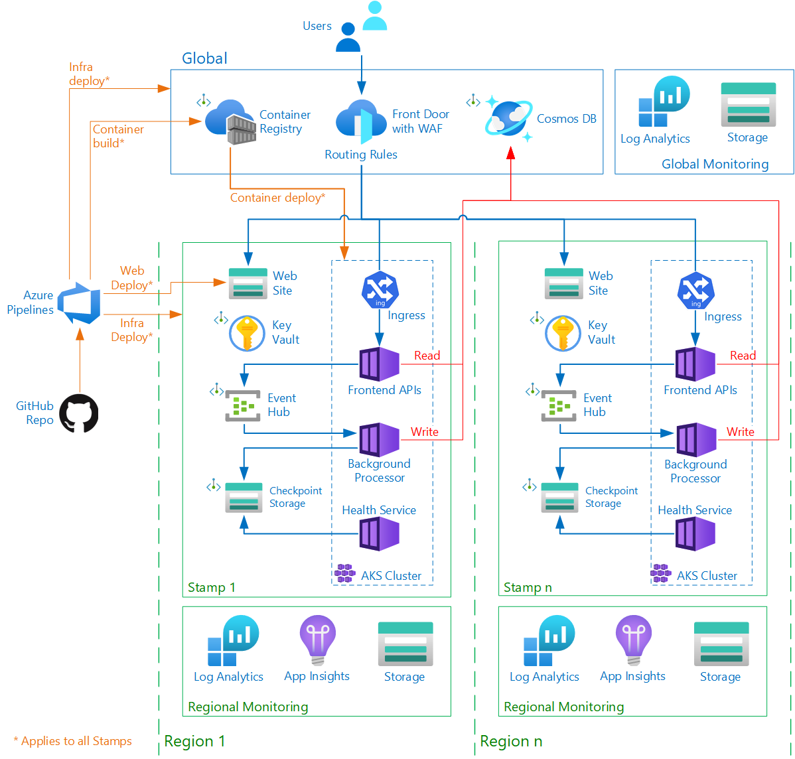

# Design areas for mission-critical workloads

This section provides design considerations and recommendations across architecturally significant topics that are relevant for a mission-critical workload. The design areas are interrelated and decisions made within one area can impact or influence decisions across the entire design.

> [!IMPORTANT]
> This article is part of the [Azure Well-Architected mission-critical workload](index.yml) series. If you aren't familiar with this series, we recommend you start with [what is a mission-critical workload?](mission-critical-overview.md#what-is-a-mission-critical-workload)
>
>  [Mission-Critical open source project](http://github.com/azure/mission-critical)
>
> There are [reference implementations](mission-critical-overview.md#illustrative-examples) available as part of an open source project on GitHub. The code assets provided by these implementations illustrate the recommendations highlighted in this article.

## Design areas
We recommend that you use the provided design guidance to navigate the key design decisions to reach an optimal solution.

|Design area|Summary|
|---|---|
|[Application design](mission-critical-application-design.md)|Learn about the importance of a scale-unit architecture in the context of building a highly reliable application. Also explores the cloud application design patterns to ensure reliability aspirations are fully achieved.|
|[Application platform](mission-critical-application-platform.md)| Decision factors and recommendations related to the selection, design, and configuration of an appropriate application hosting platform.|
|[Data platform](mission-critical-data-platform.md)|Make decisions by using key characteristics of a data platform&mdash;volume, velocity, variety, veracity. |
|[Networking and connectivity](mission-critical-networking-connectivity.md)|Network topology concepts at an application level, considering requisite connectivity and redundant traffic management. It highlights critical considerations and recommendations intended to inform the design of a secure and scalable global network topology for a mission-critical application.|
|[Health modeling and observability](mission-critical-health-modeling.md)|Processes to define a robust health model, mapping quantified application health states through observability and operational constructs to achieve operational maturity.|
|[Deployment and testing](mission-critical-deployment-testing.md)| Eradicate downtime and maintain application health for deployment operations, providing key considerations and recommendations intended to inform the design of optimal CI/CD pipelines for a mission-critical application.|
|[Security](mission-critical-security.md)|Protect the application against threats intended to directly or indirectly compromise its reliability.|
|[Operational procedures](mission-critical-operational-procedures.md)|Adoption of DevOps and related deployment methods is used to drive effective and consistent operational procedures.|

## Reference architecture

A mission-critical workload architecture is defined by the various design decisions required to ensure both functional and non-functional business-requirements are fully satisfied. The target architecture is therefore greatly influenced by the relevant business requirements, and as a result may vary between different application contexts.

The image below represents a reference architecture recommended for mission-critical workloads on Azure. It leverages a reference set of business requirements to achieve an optimized architecture for different target reliability tiers.

The [Mission-Critical Online](https://github.com/Azure/Mission-Critical-Online) and [Mission-Critical Connected](https://github.com/Azure/Mission-Critical-Connected) provide solution orientated showcases for this design methodology, demonstrating how this architecture pattern can be implemented alongside the operational wrappers required to maximize reliability and operational effectiveness.

Use these reference implementations to construct a sandbox application environment for validating key design decisions.

## Azure landing zone integration

[Azure landing zones](/azure/cloud-adoption-framework/ready/landing-zone/) provides prescriptive architectural guidance to define a reliable and scalable shared-service platform for enterprise Azure deployments with requisite centralized governance. 

This mission-critical workload series provides prescriptive architectural guidance to define a highly reliable application for mission-critical workloads that could be deployed within an Azure landing zone.

The mission-critical [reference implementations](mission-critical-overview.md#illustrative-examples) can integrate seamlessly within an Azure landing zone, and is deployable within both the *Online* or *Corp. Connected* Landing Zone formats as demonstrated within the image below.

It is crucial to understand and identify in which connectivity scenario a mission-critical application requires since Azure landing zones support different workload agnostic landing zones archetypes separated into different Management Group scopes.

> The mission-critical reference implementations are fully aligned with the Azure landing zones architectural approach and are immediately deployable within an *Online* or *Connected* Landing Zone subscription.

- In the context of an *Online* landing zone archetype, a mission-critical workload operates as a completely independent solution, without any direct corporate network connectivity to the rest of the Azure landing zone architecture. The application will, however, be further safeguarded through the [*policy-driven management*](/azure/cloud-adoption-framework/ready/enterprise-scale/dine-guidance) approach which is foundational to Azure landing zones, and will automatically integrate with centralized platform logging through policy.

  An *Online* deployment can only really consider a public application deployment since there is no private corporate connectivity provided.

- When deployed in a *Corp. Connected* Landing Zone context, the mission-critical workload takes a dependency on the Azure landing zone to provide connectivity resources which allow for integration with other applications and shared services. This necessitates some transformation on-top of the *Online* integration approach, because some foundational resources are expected to exist up-front as part of the shared-service platform. More specifically, the regional deployment stamp should not longer encompass an ephemeral Virtual Network or Azure Private DNS Zone since these will exist within the Azure landing zones *connectivity* subscription. 

  A *Corp. Connected* deployment can consider both a public or private application deployment.

## Next step

Review the best practices for architecting mission-critical application scenarios.

> [!div class="nextstepaction"]
> [Application design](./mission-critical-application-design.md)

